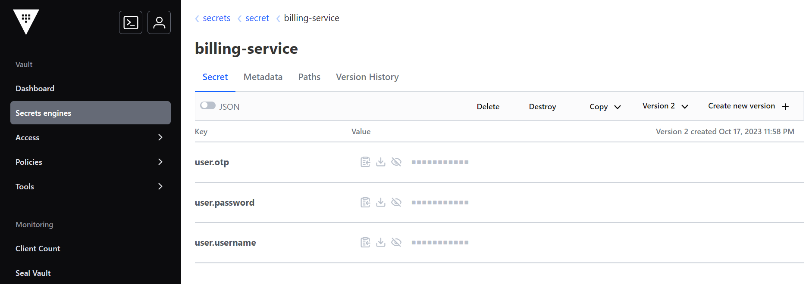

# Architectures Micro Services avec Spring Cloud
Microservices architectures with Spring Cloud are becoming increasingly popular for building distributed and scalable applications. Spring Cloud is a collection of open-source projects designed to facilitate the creation, deployment, and management of microservices-based applications. 

<b>Work to do : </b>


## Config-repo 

### application.properties
```
global.params.p1=435
global.params.p2=12
```

### customer-service.properties
```
customer.params.x=11111
customer.params.y=66666
management.endpoints.web.exposure.include=*
spring.datasource.url=jdbc:h2:mem:customer-db
spring.h2.console.enabled=true
```

### Customer-service-dev.properties 
```
customer.params.x=900
customer.params.y=500
management.endpoints.web.exposure.include=*
```

### customer-service-prod.properties
```
customer.params.x=2333
customer.params.y=876
```

### gateway-service.properties 
```
gateway.params.p1=8888
gateway.params.p2=6666
```

### inventory-service.properties
```
inv.params.a=54
inv.params.b=44
management.endpoints.web.exposure.include=*
spring.datasource.url=jdbc:h2:mem:products-db
spring.h2.console.enabled=true
```

### inventory-service-dev.properties
```
inv.params.a=988
inv.params.b=234
```

### inventory-service-prod.properties 
```
inv.params.a=111
inv.params.b=222
```

### order-service.properties

```
order.params.p1=6
order.params.p2=6
management.endpoints.web.exposure.include=*
spring.datasource.url=jdbc:h2:mem:orders-db
spring.h2.console.enabled=true
```

## config-service 
In a microservices architecture, a configuration service is responsible for managing the configuration settings and parameters for various microservices in a centralized and dynamic manner. 

### application.properties
With this configuration, your Spring Cloud Config Server will run on port 8888 and fetch configuration files from the specified Git repository. Microservices can then query this server for their configuration data using the "spring.application.name" associated with each microservice.
```
server.port=8888
spring.application.name=config-server
spring.cloud.config.server.git.uri=file:///C:/Users/triangle info/Desktop/Sanaa/Master_SDIA/S3/SystemDistr2/ecom.enset/config-repo

```

## consul 
Consul is a popular open-source tool that provides service discovery, configuration management, and health checking for distributed systems and microservices architectures. It's commonly used in cloud-native and containerized environments to manage and maintain the availability and configuration of services.


## Vault
Vault is a popular open-source tool for managing secrets and protecting sensitive data within modern IT environments. It is developed by HashiCorp and is part of the HashiCorp Infrastructure Automation suite, which includes other tools like Terraform and Consul. Vault is designed to address the challenges of managing and securing secrets, such as API keys, passwords, encryption keys, and other sensitive information, across a wide range of use cases and cloud environments.





## Customer service 
### entities
<ul><li>Customer :  This class is annotated with Jakarta Persistence annotations and also uses Lombok annotations to generate common methods. 

```
import jakarta.persistence.Entity;
import jakarta.persistence.GeneratedValue;
import jakarta.persistence.GenerationType;
import jakarta.persistence.Id;
import lombok.AllArgsConstructor;
import lombok.Builder;
import lombok.Data;
import lombok.NoArgsConstructor;

@Entity
@Data @NoArgsConstructor @AllArgsConstructor @Builder
public class Customer {
    @Id @GeneratedValue(strategy = GenerationType.IDENTITY)
    private Long id;
    private String name;
    private String email;

}
```
</li>
<li>Customer Projection: Projections in Spring Data REST allow you to define custom views of the entity data that can be returned by REST endpoints. 

```
import org.springframework.data.rest.core.config.Projection;

@Projection(name= "fullCustomer", types= Customer.class)
public interface CustomerProjection {
    public Long getId();
    public String getName();
    public String getEmail();


}
```

</li>
</ul>

### Repository 
<ul><li>Customer Repository : Is a Spring Data JPA repository interface for the Customer entity. It's annotated with @RepositoryRestResource, which is used to expose the repository as a RESTful resource.

```
import org.sdia.customerservice.entities.Customer;
import org.springframework.data.jpa.repository.JpaRepository;
import org.springframework.data.rest.core.annotation.RepositoryRestResource;

@RepositoryRestResource
public interface CustomerRepository extends JpaRepository<Customer, Long> {
}

```

</li></ul>

### Web
<ul><li>Customer Service Application : This class defines a Spring Boot application, sets up a command line runner, and performs some initial data population.

```
import org.sdia.customerservice.entities.Customer;
import org.springframework.boot.CommandLineRunner;
import org.springframework.boot.SpringApplication;
import org.springframework.boot.autoconfigure.SpringBootApplication;
import org.springframework.context.annotation.Bean;
import org.sdia.customerservice.repo.CustomerRepository;

import java.util.List;

@SpringBootApplication
public class CustomerServiceApplication {

	public static void main(String[] args) {
		SpringApplication.run(CustomerServiceApplication.class, args);
	}

	@Bean
	CommandLineRunner start(CustomerRepository customerRepository){
		return args -> {
			customerRepository.saveAll(List.of(
					Customer.builder().name("Sanaa").email("Sanaa@gmail.com").build(),
					Customer.builder().name("Sakura").email("Sakura@gmail.com").build(),
					Customer.builder().name("Oumaima").email("Oumaima@gmail.com").build()

					));
			customerRepository.findAll().forEach(System.out::println);
		};
	}

}
```

</li></ul>

### application.properties

```
server.port=8081
spring.application.name=customer-service
spring.config.import=optional:configserver:http://localhost:8888
```


## Inventory Service 
### Entities
<ul><li>Product : This class uses Jakarta Persistence annotations to define the mapping between the Java class and a database table, and it also uses Lombok annotations to generate common methods. 

```
import jakarta.persistence.Entity;
import jakarta.persistence.GeneratedValue;
import jakarta.persistence.GenerationType;
import jakarta.persistence.Id;
import lombok.AllArgsConstructor;
import lombok.Builder;
import lombok.Data;
import lombok.NoArgsConstructor;

@Entity
@Data
@NoArgsConstructor @AllArgsConstructor @Builder
public class Product {
    @Id
    @GeneratedValue(strategy = GenerationType.IDENTITY)
    private Long id;
    private String name;
    private double price;
    private int quantity;
}

```

</li>
<li>Product Projection 

```
import org.springframework.data.rest.core.config.Projection;

@Projection(name = "fullProduct", types= Product.class)
public interface ProductProjection {
    public Long getId();
    public String getName();
    public double getPrice();
    public int getQuantity();
}
```
</li></ul>

### Repository
<ul><li>Product Repository: Is a Spring Data JPA repository interface for the Product entity. It's annotated with @RepositoryRestResource, which is used to expose the repository as a RESTful resource.

```
import org.sdia.inventoryservice.entities.Product;
import org.springframework.data.jpa.repository.JpaRepository;
import org.springframework.data.rest.core.annotation.RepositoryRestResource;

@RepositoryRestResource
public interface ProductRepository extends JpaRepository<Product, Long> {
}

```

</li>

</ul>

### Inventory Service Application 
Is a Spring Boot application class for an inventory service. This class defines a Spring Boot application, sets up a command line runner, and performs initial data population for the inventory service.

```
import org.sdia.inventoryservice.entities.Product;
import org.sdia.inventoryservice.repo.ProductRepository;
import org.springframework.boot.CommandLineRunner;
import org.springframework.boot.SpringApplication;
import org.springframework.boot.autoconfigure.SpringBootApplication;
import org.springframework.cloud.client.discovery.EnableDiscoveryClient;
import org.springframework.context.annotation.Bean;

import java.util.List;
import java.util.Random;

@SpringBootApplication
@EnableDiscoveryClient
public class InventoryServiceApplication {

	public static void main(String[] args) {
		SpringApplication.run(InventoryServiceApplication.class, args);
	}

	@Bean
	CommandLineRunner start(ProductRepository productRepository){
		return args -> {
			Random random=new Random();
			for (int i = 1; i < 10; i++) {
				productRepository.saveAll(List.of(
						Product.builder()
								.name("Computer"+i)
								.price(1200+Math.random()*10000)
								.quantity(1+random.nextInt(200))
								.build()
				));
			}

		};

	}
}
```

### application.properties

```
server.port=8082
spring.application.name=inventory-service
spring.config.import=optional:configserver:http://localhost:8888

```


## Order Service
### Entities 
<ul><li>Order : This class represents an order in the context of an order service or e-commerce application. It uses Jakarta Persistence annotations to define the mapping between the Java class and a database table, and it also uses Lombok annotations to generate common methods. 

```
import jakarta.persistence.*;
import lombok.AllArgsConstructor;
import lombok.Builder;
import lombok.Data;
import lombok.NoArgsConstructor;
import org.sdia.orderservice.enums.OrderStatus;
import org.sdia.orderservice.model.Customer;

import java.util.Date;
import java.util.List;
@Entity
@Table(name = "orders")
@Data
@NoArgsConstructor @AllArgsConstructor @Builder
public class Order {
    @Id @GeneratedValue(strategy = GenerationType.IDENTITY)
    private Long id;
    private Date createdAt;
    private OrderStatus status;
    private Long customerId;
    @Transient
    private Customer customer;
    @OneToMany(mappedBy = "order")
    private List<ProductItem> productItems;
    
    public double getTotal(){
        double somme=0;
        for (ProductItem pi:productItems) {
            somme+=pi.getAmount();
            
        }
        return somme;
    }

}
```

</li>

<li>Order Projection : Projections in Spring Data REST allow you to define custom views of your entity data that can be returned by REST endpoints.

```
import org.sdia.orderservice.enums.OrderStatus;
import org.springframework.data.rest.core.config.Projection;

import java.util.Date;

@Projection(name="fullOrder", types=Order.class)
public interface OrderProjection {
Long getId();
Date getCreatedAt();
Long getCustomerId();
OrderStatus getStatus();
}
```

</li>
<li>Prduct Item : This class represents a product item within an order and contains information about the product, its price, quantity, and any discounts applied.

```
import com.fasterxml.jackson.annotation.JsonProperty;
import jakarta.persistence.*;
import lombok.AllArgsConstructor;
import lombok.Builder;
import lombok.Data;
import lombok.NoArgsConstructor;
import org.sdia.orderservice.model.Product;

@Entity
@Data @NoArgsConstructor @AllArgsConstructor @Builder
public class ProductItem {
    @Id
    @GeneratedValue(strategy = GenerationType.IDENTITY)
    private Long id;
    private Long productId;
    @Transient
    private Product product;
    private double price;
    private int quantity;
    private double discount;
    @ManyToOne
    @JsonProperty(access = JsonProperty.Access.WRITE_ONLY)
    private Order order;

    public double getAmount(){
        return price*quantity*(1-discount);
    }
}

```
</li>
</ul>

### Enums 

```
public enum OrderStatus {
    CREATED, PENDING, DELIVERED, CANCELED
}

```

### Repo
<ul><li>Order Repository : is a Spring Data JPA repository interface for the Order entity, and it defines a custom query method for finding orders by customer ID. It's annotated with @RepositoryRestResource to expose the repository as a RESTful resource.

```
import org.sdia.orderservice.entities.Order;
import org.sdia.orderservice.entities.ProductItem;
import org.springframework.data.jpa.repository.JpaRepository;
import org.springframework.data.repository.query.Param;
import org.springframework.data.rest.core.annotation.RepositoryRestResource;
import org.springframework.data.rest.core.annotation.RestResource;

import java.util.List;

@RepositoryRestResource
public interface OrderRepository extends JpaRepository<Order, Long > {
    @RestResource(path = "/byCustomerId")
    List<Order> findByCustomerId(@Param("customerId") Long customersId);
}

```
</li>
<li>Product Item Repository : Is a Spring Data JPA repository interface for the ProductItem entity. It's annotated with @RepositoryRestResource to expose the repository as a RESTful resource.

```
import org.sdia.orderservice.entities.ProductItem;
import org.springframework.data.jpa.repository.JpaRepository;
import org.springframework.data.rest.core.annotation.RepositoryRestResource;

@RepositoryRestResource
public interface ProductItemRepository extends JpaRepository<ProductItem, Long > {
}
```


</li></ul>

### Services
<ul><li>Customer Rest Client Service :Feign is a popular declarative web service client in the Spring ecosystem, and this interface is used to interact with a remote service (the "customer-service") via HTTP requests. 

```
import org.sdia.orderservice.model.Customer;
import org.springframework.cloud.openfeign.FeignClient;
import org.springframework.hateoas.PagedModel;
import org.springframework.web.bind.annotation.GetMapping;
import org.springframework.web.bind.annotation.PathVariable;

import java.util.List;

@FeignClient(name = "customer-service")
public interface CustomerRestClientService {
    @GetMapping("/customers/{id}?projection=fullCustomer")
    public Customer customerById(@PathVariable Long id);

    @GetMapping("/customers?projection=fullCustomer")
    public PagedModel<Customer> allCustomers();
}
```

</li>
<li>Inventory Rest Client Service : Similar to the previous interface, this interface is used to interact with a remote service (the "inventory-service") via HTTP requests. 

```
import org.sdia.orderservice.model.Customer;
import org.sdia.orderservice.model.Product;
import org.springframework.cloud.openfeign.FeignClient;
import org.springframework.hateoas.PagedModel;
import org.springframework.web.bind.annotation.GetMapping;
import org.springframework.web.bind.annotation.PathVariable;

import java.util.List;

@FeignClient(name = "inventory-service")
public interface InventoryRestClientService {
    @GetMapping("/products/{id}?projection=fullProduct")
    public Product ProductById(@PathVariable Long id);

    @GetMapping("/products?projection=fullProduct")
    public PagedModel<Product> allProducts();
}
```

</li></ul>

### Web 
<ul><li>Order Rest Controller :This class is responsible for handling HTTP requests related to orders. It uses Feign clients to fetch additional information about customers and products associated with the order. 

```
import org.sdia.orderservice.entities.Order;
import org.sdia.orderservice.model.Customer;
import org.sdia.orderservice.model.Product;
import org.sdia.orderservice.repo.OrderRepository;
import org.sdia.orderservice.repo.ProductItemRepository;
import org.sdia.orderservice.service.CustomerRestClientService;
import org.sdia.orderservice.service.InventoryRestClientService;
import org.springframework.web.bind.annotation.GetMapping;
import org.springframework.web.bind.annotation.PathVariable;
import org.springframework.web.bind.annotation.RestController;

@RestController
public class OrderRestController {
    private OrderRepository orderRepository;
    private ProductItemRepository productItemRepository;
    private CustomerRestClientService customerRestClientService;
    private InventoryRestClientService inventoryRestClientService;

    public OrderRestController(OrderRepository orderRepository, ProductItemRepository productItemRepository, CustomerRestClientService customerRestClientService, InventoryRestClientService inventoryRestClientService) {
        this.orderRepository = orderRepository;
        this.productItemRepository = productItemRepository;
        this.customerRestClientService = customerRestClientService;
        this.inventoryRestClientService = inventoryRestClientService;
    }

    @GetMapping("/fullOrder/{id}")
    public Order getOrder(@PathVariable Long id){
        Order order =orderRepository.findById(id).get();
        Customer customer=customerRestClientService.customerById(order.getCustomerId());
        order.setCustomer(customer);
        order.getProductItems().forEach(pi -> {
            Product product=inventoryRestClientService.ProductById(pi.getProductId());
            pi.setProduct(product);
        });
        return order;


    }
}

```

</li></ul>

### Order Service Application 

```
import org.sdia.orderservice.entities.Order;
import org.sdia.orderservice.entities.ProductItem;
import org.sdia.orderservice.enums.OrderStatus;
import org.sdia.orderservice.model.Customer;
import org.sdia.orderservice.model.Product;
import org.sdia.orderservice.repo.OrderRepository;
import org.sdia.orderservice.repo.ProductItemRepository;
import org.sdia.orderservice.service.CustomerRestClientService;
import org.sdia.orderservice.service.InventoryRestClientService;
import org.springframework.boot.CommandLineRunner;
import org.springframework.boot.SpringApplication;
import org.springframework.boot.autoconfigure.SpringBootApplication;
import org.springframework.cloud.openfeign.EnableFeignClients;
import org.springframework.context.annotation.Bean;

import java.util.Collection;
import java.util.Date;
import java.util.List;
import java.util.Random;

@SpringBootApplication
@EnableFeignClients
public class OrderServiceApplication {

	public static void main(String[] args) {
		SpringApplication.run(OrderServiceApplication.class, args);
	}

	@Bean
	CommandLineRunner start(OrderRepository orderRepository, ProductItemRepository productItemRepository,
			CustomerRestClientService customerRestClientService,
			InventoryRestClientService inventoryRestClientService
	){
		return args -> {
			List<Customer> customers=customerRestClientService.allCustomers().getContent().stream().toList();
			List<Product> products=inventoryRestClientService.allProducts().getContent().stream().toList();
			Long customerId=1L;
			Random random=new Random();
			Customer customer=customerRestClientService.customerById(customerId);
			for (int i = 0; i <20 ; i++) {
				Order order= Order.builder()
						.customerId(customers.get(random.nextInt(customers.size())).getId())
						.status(Math.random()>0.5? OrderStatus.PENDING:OrderStatus.CREATED)
						.createdAt(new Date())
						.build();
				Order saveOrder=orderRepository.save(order);

				for (int j = 0; j < products.size(); j++) {
					if(Math.random()>0.70){
						ProductItem productItem=ProductItem.builder()
								.order(saveOrder)
								.productId(products.get(j).getId())
								.price(products.get(j).getPrice())
								.quantity(1+random.nextInt(10))
								.discount(Math.random())
								.build();
						productItemRepository.save(productItem);

					}


				}
			}

		};

	}

}

```

### application.properties

```
server.port=8083
spring.application.name=order-service
spring.config.import=optional:configserver:http://localhost:8888
logging.level.org.sdia.orderservice.services.CustomerRestClientService=debug
logging.level.org.sdia.orderservice.services.InventoryRestClientService=debug
feign.client.config.default.loggerLevel=full 
```


## Gateway Service 
### Gateway Service Application
It is a gateway service that serves as a part of a microservices architecture and uses Spring Cloud Gateway for routing requests. Specifically, it utilizes dynamic routing based on service discovery with the help of ReactiveDiscoveryClient and DiscoveryClientRouteDefinitionLocator. 

```
import org.springframework.boot.SpringApplication;
import org.springframework.boot.autoconfigure.SpringBootApplication;
import org.springframework.cloud.client.discovery.ReactiveDiscoveryClient;
import org.springframework.cloud.gateway.discovery.DiscoveryClientRouteDefinitionLocator;
import org.springframework.cloud.gateway.discovery.DiscoveryLocatorProperties;
import org.springframework.context.annotation.Bean;

@SpringBootApplication
public class GatewayServiceApplication {

	public static void main(String[] args) {
		SpringApplication.run(GatewayServiceApplication.class, args);
	}


	@Bean
	DiscoveryClientRouteDefinitionLocator dynamicRoutes(ReactiveDiscoveryClient rdc, DiscoveryLocatorProperties dlp){
		return new DiscoveryClientRouteDefinitionLocator(rdc, dlp);
	}
}
```

## Billing Service 
### Consul Config Rest Controller 
This controller is responsible for exposing an HTTP endpoint that returns configuration information. It appears to be designed for use with Consul and Vault configurations.

```
import org.springframework.beans.factory.annotation.Autowired;
import org.springframework.beans.factory.annotation.Value;
import org.springframework.cloud.context.config.annotation.RefreshScope;
import org.springframework.web.bind.annotation.GetMapping;
import org.springframework.web.bind.annotation.RestController;

import java.util.Map;
import java.util.Objects;

@RestController
public class ConsulConfigRestController {
    @Autowired
    private MyConsulConfig myConsulConfig;
    @Autowired
    private MyVaultConfig myVaultConfig;
   // @Value("${token.accessTokenTimeout}")
    //private long accessTokenTimeout;
    //@Value("${token.refreshTokenTimeout}")
    //private long refreshTokenTimeout;

    @GetMapping("/myConfig")
    public Map<String, Object> myConfig(){
        return Map.of("consulConfig",myConsulConfig,"vaultConfig",myVaultConfig);

    }
}
```

### My Consul Config 
This class uses the Lombok library to simplify the creation of getter and setter methods for its properties. It is also annotated with @Component and @ConfigurationProperties to define and bind configuration properties.

```
import lombok.Data;
import org.springframework.boot.context.properties.ConfigurationProperties;
import org.springframework.stereotype.Component;

@Component
@ConfigurationProperties(prefix="token")
@Data
public class MyConsulConfig {
    private long accessTokenTimeout;
    private long refreshTokenTimeout;
}

```
### My Vault Config 
This class is used for binding configuration properties, and it also uses the Lombok library to simplify the generation of getter and setter methods.

```
import lombok.Data;
import org.springframework.boot.context.properties.ConfigurationProperties;
import org.springframework.stereotype.Component;

@Component
@ConfigurationProperties(prefix="user")
@Data
public class MyVaultConfig {
    private String username;
    private String password;
    private String otp;
}

```
### Billing Application
This application interacts with HashiCorp Vault, a tool for managing secrets and protecting sensitive data. Specifically, it demonstrates how to use the VaultTemplate to store secrets in Vault. 

```
import org.springframework.beans.factory.annotation.Autowired;
import org.springframework.boot.CommandLineRunner;
import org.springframework.boot.SpringApplication;
import org.springframework.boot.autoconfigure.SpringBootApplication;
import org.springframework.context.annotation.Bean;
import org.springframework.vault.core.VaultTemplate;

import java.util.Map;

@SpringBootApplication
public class BillingApplication {
    @Autowired
	private VaultTemplate vaultTemplate;
	public static void main(String[] args) {
		SpringApplication.run(BillingApplication.class, args);
	}

    @Bean
	CommandLineRunner commandeLineRunner(){
		return args -> {
			vaultTemplate.opsForVersionedKeyValue("secret")
					.put("keypair", Map.of("privKey","54321","pubKey","8999"));
		};
	};
}
```

### application.properties 
```
spring.application.name=billing-service
server.port=8084

spring.cloud.vault.token=hvs.JaX3b5jFvGR1sY1BH5ifAp0T
spring.cloud.vault.scheme=http
spring.cloud.vault.kv.enabled=true
spring.config.import=optional:consul:, vault://
management.endpoints.web.exposure.include=*

```

## Angular Application 


